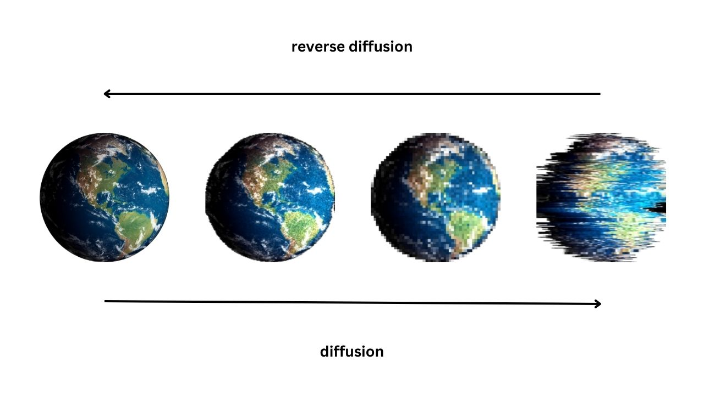

# AstroDiffusion
Denoising Diffusion Probabilistic Model for Synthetic Astronomical Data Generation

## Overview
This project features a Denoising Diffusion Probabilistic Model (DDPM), a cutting-edge generative model based on diffusion processes. For more technical details, please see [Original DDPM Paper](https://arxiv.org/abs/2006.11239)



In my research within Astronomy and Astrophysics, I observed that authentic, well-calibrated visual data is scarce and often takes significant time to be publicly available due to complex observation and calibration processes. To overcome this limitation for large-scale research, synthetic data has emerged as an effective alternative. This project builds a DDPM that learns the underlying distribution of the available training data and generates highly realistic synthetic images from pure noise input.

## Get Started 

### Prerequisites
- Python 3.13
- Git

### Installation
1. **Clone the repository**
    ```
      git clone <repository-url>
      cd galaxies-ml-proj 
    ```
         
2. **Create and activate virtual environment**

    ```
      python -m venv venv

      # On Windows
      venv\Scripts\activate

      # On macOS/Linux
      source venv/bin/activate 
    ```
   
3. **Install dependencies**
   
    ```
      pip install -r requirements.txt
    ```

4. **Install PyTorch (GPU or CPU)**
   
   See: https://pytorch.org/get-started/locally/

### Acquiring Data
The GalaxiesML dataset is publicly available at https://datalab.astro.ucla.edu/galaxiesml.html

This dataset has lots of morphological parameters so you can make your own dataset class based on specific model objectives. In this project, I keep it simple by using 64x64 pixel images across 5 bands g, r, i, z, y and their corresponding ellipticity parameters. See `src/utils/dataset.py` for the architecture of my dataset class. 

Download the train, val dataset from link provided and place them in splitted folder. For example:

<pre>
   data/
   ├── train/galaxies_ml_train_set.hdf5
   └── val/galaxies_ml_val_set.hdf5
</pre>

## Configuration
Experiment parameters are defined in YAML. See `config/train_ddpm.yaml` and adjust if you need!

```yaml
   model: 
      Channels: [64, 128, 256, 512, 512, 384]
      Attentions: [False, True, False, False, False, True]
      Upscales: [False, False, False, True, True, True]
      num_groups: 32 
      dropout_prob: 0.1
      num_heads: 8
      input_channels: 5
      output_channels: 5
      time_steps: 1000

   train:
      batch_size: 32
      criterion: 
        # All string-supported loss can be found in 'src/loss/loss_registry.py'
        name: 'mse_loss'
        kwargs:
            reduction: 'mean' # 'mean', 'sum', 'none'
      
      optimizer:
        # All string-supported optimizer can be found in 'src/loss/optim_registry.py' 
        name: 'adam' 
        kwargs:
            lr: 0.00002
            eps: 0.0001
            weight_decay: 0.0
      scheduler:
        # All string-supported schedulers can be found in 'src/optim/scheduler_registry.py'
        name: 'exponential_lr'
        kwargs:
            gamma: 0.96
      callbacks: 
        # All string-supported callbacks can be found in 'src/utils/callbacks.py'
        - name: 'early_stopping'
          kwargs:
              monitor: 'val_loss'  # 'val_loss' or 'val_acc'
              mode: 'min'  # 'min' or 'max'
              patience: 2
              min_delta: 0.01
      num_epochs: 20
      start_epoch: 0
      logging_dir: 'log'
      logging_steps: 100
      progress_bar: True
      save_best: True
      save_ckpt: True
      save_fig: True
      num_workers: 8
      pin_memory: True
```

Model and training configs are parsed and fed into the trainers.

## Train and Inference

A lightweight CLI script is provided in `script/` and use YAML config as described above. The script supports single-GPU / CPU runs and will spawn processes for multi-GPU (DDP) when multiple CUDA devices are visible. 

### Example Usage:

<pre>
   # single-GPU or CPU
   python -m script.train_ddpm \
       --config_path config/train_ddpm.yaml \
       --checkpoint_path log/Diffusion_Unet/checkpoints/run_01.pt \
       --train_data_dir ./data/train/galaxies_ml_train_set.hdf5
       --val_data_dir ./data/val/galaxies_ml_val_set.hdf5
</pre>

Key flags for `script/train_ddpm.py`:
- --config_path: Path to the YAML experiment (default: `config/train_ddpm.yaml`)
- --checkpoint_path: Optional trainer checkpoint to resume training
- --train_data_dir: Directory of training dataset (default: `./data/train/galaxies_ml_train_set.hdf5`)
- --val_data_dir: Directory of validation dataset (default: `./data/val/galaxies_ml_val_set.hdf5`)

### Notes

- The model automatically run a quick inference on random noise to generate synthetic data at the end of training phase. The results are saved as jpg in `log/Diffusion_Unet/output` along with training and validation loss graph. Change `num_images, image_size, saving_steps` parameter for `inference()` method in `script/train_ddpm.py` for your convenience.
- Training on HPC Cluster is highly recommended as local training may cost extensive time for significant model performance

## Development & Contribution
- Model: You can change/add models inside `src/model` and change/add those models' config in `src/config/model_config.py`
- Trainer: You can change trainer in `src/engine/trainer.py` and its config in `src/config/train_config.py` or you can build new customized trainer for your model on top of original trainer (see `src/engine/ddpm_trainer.py` for example)
- Loss: You can build customized loss and put it in `src/loss`. Make sure to add string-supported name of that loss in `src/loss/loss_registry.py` to use the string name in YAML file
- Optim/Scheduler: The same as loss, you can build customized optim/scheduler and put it in `src/optim` with string-supported name in `src/optim/optim_registry.py` and `src/optim/scheduler_registry.py`
- Callback: See `src/utils/callback.py`

## Project Structure
```
galaxies-ml-proj/
├── src/
│   ├── config/            # Dataclasses and loaders for YAML configs
│   ├── engine/            # Training/evaluation engine
│   ├── loss/              # Loss functions and registry
│   ├── model/             # Particle Transformer and variants
│   ├── optim/             # Optimizers/schedulers registries
│   └── utils/             # Callbacks, metrics, data, viz helpers 
├── script/                # CLI tools
├── log/                   # Runs: best weights, CSV logs, checkpoints, outputs
├── data/                  # ROOT files (train/val/test splits)
├── config/                # YAML model & trainer parameter tuning 
├── job/                   # Slurm file for HPC running (irrelevent to single GPU/CPU) 
├── notebook/              # Jupyter notebooks if applicable
└── asset/                 # Figures assets
```